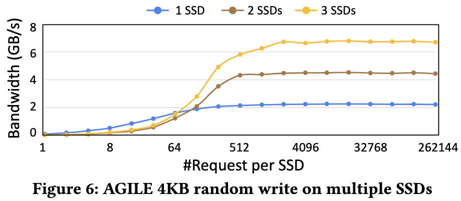

<p align="center">
  <picture>
    
  </picture>
</p>

<h2 align="center">
AGILE: Lightweight and Efficient Asynchronous GPU-SSD Integration
</h2>


## Citation
Paper is available at [arXiv](https://arxiv.org/abs/2504.19365)
---
```bibtex
@inproceedings{sc25agile,
author = {Yang, Zhuoping and Zhuang, Jinming and Chen, Xingzhen and Jones, Alex K and Zhou, Peipei},
title = {AGILE: Lightweight and Efficient Asynchronous GPU-SSD Integration},
year = {2025},
booktitle = {Proceedings of the International Conference for High Performance Computing, Networking, Storage, and Analysis, SC 2025},
series = {Supercomputing '25}
}
```
---


### Thanks for your interest in this project. Your growing engagement will inspire us to improve and enhance AGILE continually.
<p align="center">
  <picture>
    
  </picture>
</p>

## 🎉 AGILE tutorial examples are keeping updating now! See [./tutorial](./tutorial) 👀

## Installation

AGILE requires a modified version of [GDRCopy](https://github.com/NVMe-SSD/GDRCopy), which is included in this repo ([./driver/gdrcopy](./driver/gdrcopy)). Please follow the instructions to build and install it.

To use AGILE, you must ***backup all data*** and switch to the AGILE NVMe driver for the target NVMe SSDs. Check [switch to AGILE driver](./tutorial/00_Select_Target_SSD) for more details.

AGILE relies on the GPUs' BAR1 Memory as the source and destination in GPU-SSD peer-to-peer communication. If the default BAR1 memory size is too small (typically 128MB), please refer [NVIDIA Display Mode Selector Tool](https://developer.nvidia.com/displaymodeselector) (1.67.0) to increase the BAR1 memory size.

Disable IOMMU in `/etc/default/grub` by adding `intel_iommu=off` flag to `GRUB_CMDLINE_LINUX_DEFAULT`. Then, update grub (`sudo update-grub`) and reboot (`sudo reboot`) the machine.

## Experiments
AGILE has been evaluated on a Dell R750 server running Ubuntu 20.04, equipped with an Nvidia RTX 5000 Ada GPU, a Dell Ent NVMe AGN MU AIC 1.6TB SSD, and two Samsung 990 PRO 1TB SSDs. The Nvidia Driver version is 550.54, and the CUDA version is 12.8.

For setting up the baseline BaM, please refer to [https://github.com/ZaidQureshi/bam](https://github.com/ZaidQureshi/bam). The BaM version baselines can be found at [./baseline/benchmarks](./baseline/benchmarks).

### Experimental results in Figure 4 - 12





### **Table: Experimental Bash scripts for reproducing results for Figure 4 - 11.**
| Figures      | Corresponding Scripts                |
|--------------|---------------------------------------|
| Figure 4     | `run_ctc.sh`                          |
| Figure 5     | `rand_read.sh`                        |
| Figure 6     | `rand_write.sh`                       |
| Figure 7 - 10| `run_dlrm.sh` & `auto_dlrm.sh`         |
| Figure 11    | `run_bfs*.sh` & `run_spmv*.sh`         |

## Todo-List

We will keep updating AGILE with more features, and you are more than welcome to request more functionalities. Currently, we have the following plans for improving AGILE:

- [x] Avoid using /dev/mem when accessing PCIe BAR.
- [x] Avoid using /etc/default/grub to allocate contiguous buffers.
- [x] Support for Docker container.
- [ ] Avoid relying on GDRCopy to expose GPU's HBM to user space.
- [ ] Optimizing DMA performance between GPU's HBM and CPU's DRAM.
- [ ] Include CPU DRAM as an additional level of software cache.
- [ ] Tutorial examples.
- [ ] Add documentation for AGILE (APIs, customizing software-cache policy, etc.)
- [ ] Update the benchmarking code using new AGILE kernel modules.
- [ ] Provide more software cache policies.
- [ ] Support for multi-GPU-multi-SSD.


