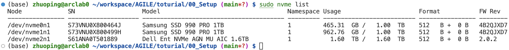
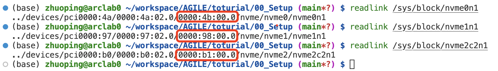
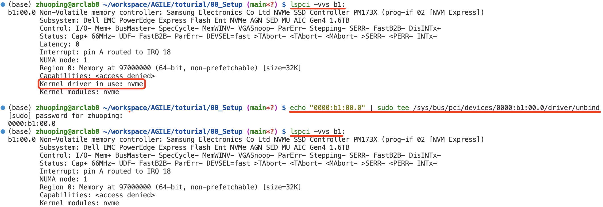
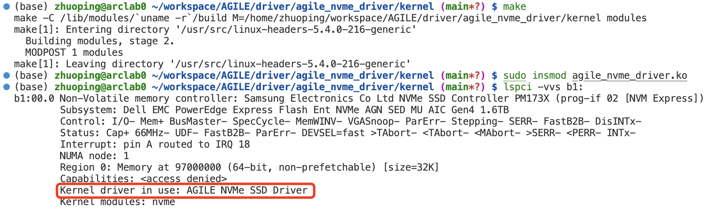
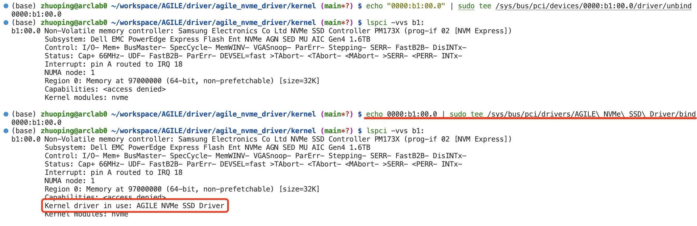
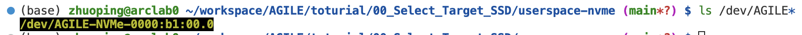
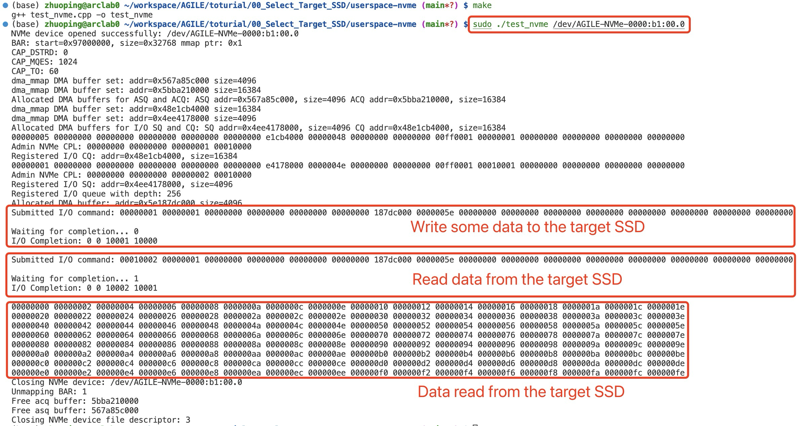

# Switch NVMe SSDs' driver to the AGILE NVMe driver

By default, the NVMe SSDs in your system are using the nvme driver, and you can use `sudo nvme list` to find all NVMe SSDs in your system as shown in the following image.
> **sudo apt install nvme-cli** for command **nvme**  

To use these SSDs in AGILE, we need to unbind the default nvme driver switch to the AGILE nvme driver. 

First, we need to know what is the PCIe Bus-Device-Function (BDF) of this target SSD using `readlink /sys/block/nvmexxx`

Therefore, the PCIe BDF of these SSDs are `0000:4b:00.0`, `0000:98:00.0`, and `0000:b1:00.0` respectively.

Suppose we use the third SSD in AGILE, we need to **backup all data** in that SSD and unbind the default nvme driver as shown in the following image:

Then, we need to bind the AGILE nvme driver by `insmod` or manually binding AGILE NVMe driver if already installed:

`insmod`: 

Manually binding:

After binding the AGILE NVMe SSD driver, you should be able to find a new device file: /dev/AGILE-NVMe-`PCIe BDF`:

Finally, you can run the test program to verify the functionality of the AGILE NVMe SSD driver. The test program will allocate a DMA buffer, write data to the NVMe device, read it back, and print the results. Find the test program in `userspace-nvme`. The output of the program should look like this:

