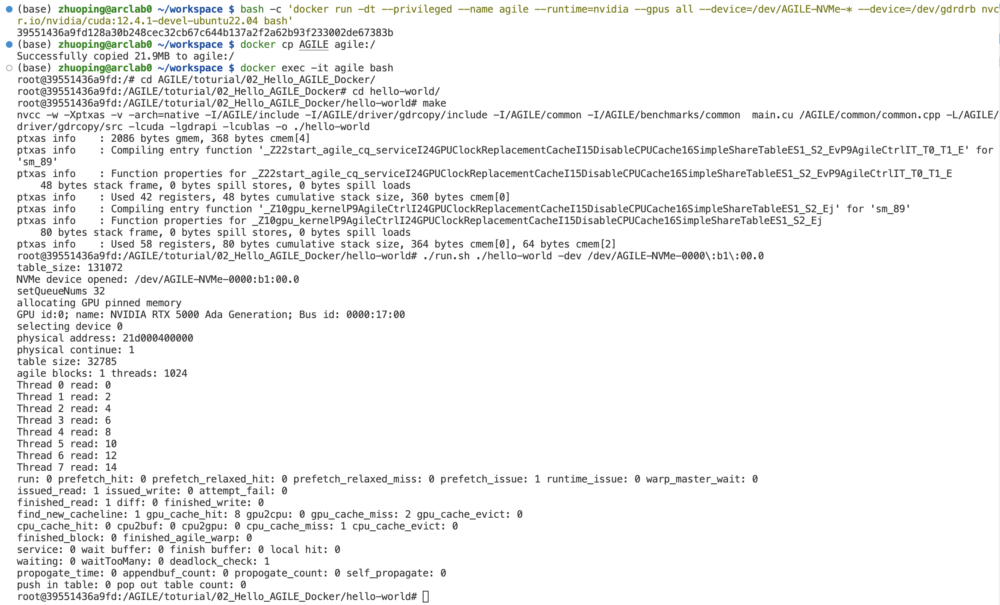

# Hello AGILE in Docker

To use AGILE in Docker containers, you need to compile and install all necessary kernel modules including [gdrcopy](../../driver/gdrcopy/) and [AGILE NVMe driver](../../driver/agile_nvme_driver/) on the host machine and swith the target SSDs' driver to AGILE. Then you can create a container like this:

```bash
bash -c 'docker run -dt --privileged --name agile --runtime=nvidia --gpus all --device=/dev/AGILE-NVMe-* --device=/dev/gdrdrb nvcr.io/nvidia/cuda:12.4.1-devel-ubuntu22.04 bash' 
```

After creating the container, copy the source file folder of AGILE into that container:
```bash
docker cp AGILE agile:/
```

Login to the container:
```bash
docker exec -it agile bash
```

Finally, executing the hello world example in *02_Hello_AGILE_Docker*. The expected output looks like:



---
```go

```
---
