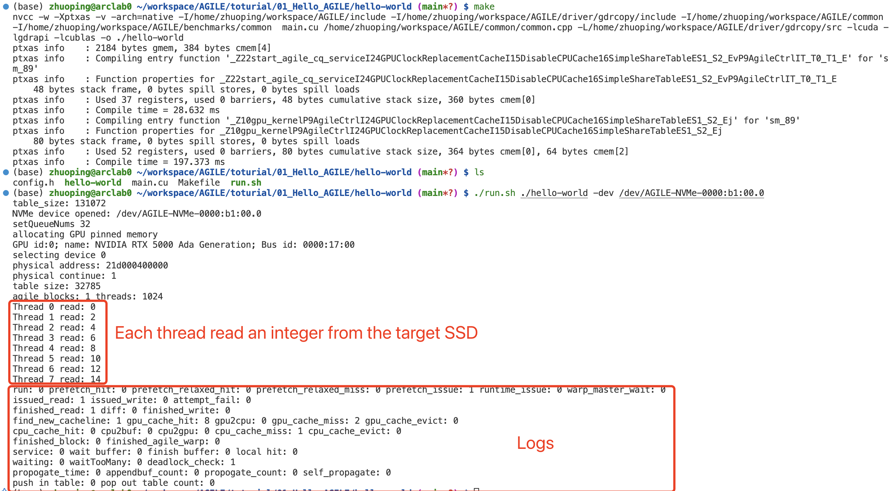

# Hello AGILE
You can execute the Hello World program to check if your environment has been set up correctly. The expected output looks like:

> Note: You need to change the ***AGILE_PATH*** in `run.sh` and `Makefile`

